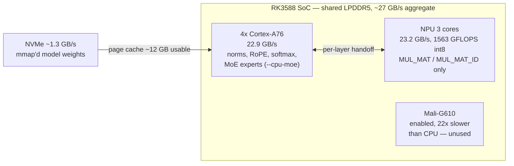

# RK3588 benchmark tables

Board: **Radxa ROCK 5B+** — RK3588, 4x Cortex-A76 @ 2.35 GHz + 4x A55, 6 TOPS NPU,
**16 GB** LPDDR5-4800, NVMe. Debian 12, kernel 6.1.84, rknpu driver 0.9.8,
librknnrt 2.3.x.

Unless a row says otherwise: `taskset -c 4-7`, `performance` governors on CPU +
DRAM + NPU, `ulimit -n 1000000`, warm runs only with the first run discarded.

- **PP** = prompt processing (prefill) t/s
- **TG** = token generation (decode) t/s
- Every row marked OK was checked for **coherent output**, not only for speed.

> **Read section 9 before quoting any number from this file.** Three separate
> bugs during this work produced plausible speeds with wrong output, and two of
> our own published figures had to be retracted. Which measurement conditions
> apply changes results by up to 52%.

---

## 1. Where the work actually runs



The NPU implements **only** `MUL_MAT` and `MUL_MAT_ID` (plus, in this fork, cheap
"glue" ops kept on-device to avoid handoffs). Everything else runs on the CPU, so
a token crosses between the two hundreds of times. That is why NPU utilisation is
low during decode and why reducing graph splits matters.

## 2. Production model — Qwen3-30B-A3B-Instruct-2507

30.5 B total / 3.3 B active, 128 experts, top-8, 48 layers.

| # | quant | boards | expert placement | extra flags | PP | TG | OK |
|---|---|---|---|---|---|---|---|
| 1 | Q4_0 | 1 | CPU (`--cpu-moe --no-repack`) | — *(earlier baseline)* | 8.66 | 6.5 | OK |
| 2 | Q4_0 | 1 | CPU | `-fa on` + `W8A8` + `GLUE` **(free)** | **12.7** | **7.4** | OK |
| 3 | Q4_0 | 1 | CPU | row 2 + `expert_used_count=4` | **21.1** | **9.6** | OK ★ |
| 4 | Q4_0 | 1 | 10 layers on NPU (int8) | row 3 flags | 18.2 | 5.3 | OK |
| 5 | Q4_0 | 3 | **all 48 layers on NPU** (int8) | `-fa on` + `GLUE` + rpc | **26.6** | 2.5 | OK |
| 6 | Q4_0 | 3 | all on NPU, KV on devices | `-fa on`, no `-nkvo` | 26.3 | 1.2 | OK |
| 7 | Q4_0 | 3 | all on NPU | no `-fa` | 8.2 | — | OK |
| 8 | Q8_0 (30 GB) | 1 | CPU mmap `--no-repack` | **2x board RAM** | — | 1.2-2.3 | OK |
| 9 | Q3_K_M | 1 | CPU (Q3_K is not NPU-eligible) | — | — | ~7.6 | OK |

★ Row 3 is the deployed configuration. Rows 5-7 are the multi-board experiments:
**best prefill, worst decode** — see [MULTI-BOARD.md](MULTI-BOARD.md).

Row 2 is the important one for anyone else: `-fa on` plus routing `Q4_0` through
the **int8** pipeline costs nothing in quality and is worth ~47% prefill.

## 3. Other models

| model | params (active) | quant | boards | PP | TG | OK |
|---|---|---|---|---|---|---|
| Qwen3.6-35B-A3B | 35.5 B (3 B) | Q4_0 (20.8 GB) | 1 | 18.5 | 4.07 @676 tok | OK |
| Qwen3.6-27B **dense** | 27 B (27 B) | Q8_0 | 3 (rktp) | — | **1.05** | OK |
| Qwen3.6-27B dense | 27 B | Q8_0 | 3 (`-sm layer`) | — | 0.53 | OK |
| Qwen3.6-27B dense | 27 B | Q4_0 (15.8 GB) | 1 | — | ~0.5 (I/O bound) | OK |
| gemma-4-12B dense | 12 B | Q8_0 | 1 | — | 1.12-1.54 | OK |
| gemma-4-12B dense | 12 B | Q8_0 | 2 (rktp) | — | 1.12 | OK |
| gemma-4-12B dense | 12 B | Q8_0 | 3 (rktp) | — | 1.29 | OK |
| gemma-4-E4B | 8 B (4.5 B) | Q8_0 | 1 | 38.2 | 4.04 | OK |
| gemma-3-1B | 1 B | Q8_0 | 1 | 201.6 | 17.0 | OK |
| Qwen3-30B-A3B | 30 B (3.3 B) | Q8_0 (31 GB) | 1 | — | 1.2-2.3 | OK |
| gpt-oss-120b | 117 B (5.1 B) | Q8_0 (**60 GB, 4x RAM**) | 1 | — | 0.88 | OK |
| gpt-oss-20b | 21 B (3.6 B) | MXFP4 native | 1 | 13.1 | 6.1-8.0 | **incoherent** |
| gpt-oss-20b | 21 B (3.6 B) | Q4_0 requantized | 1 | 13.7 | 7.5 | **incoherent** |

gpt-oss needs the Hadamard pipeline to produce coherent output, and Hadamard pads
K from 2880 to 4096 — a 42% waste that makes its NPU buffer *larger* than the
30B's despite being a smaller model. Any model whose hidden dimension is not a
power of two pays that tax.

## 4. Residency — the dominant variable

Same model (`Qwen3-30B-A3B` Q4_0, 17.3 GB), same board, differing only in whether
the working set stays resident. `nvme` is read volume **per request**.

| condition | context | TG | nvme |
|---|---|---|---|
| repeated identical prompt, warm | 9 tok | **9.15** | **3.2 MB** |
| repeated identical prompt, warm | 670 tok | **6.90** | **9.2 MB** |
| **unique prompt per request** | 675 tok | 5.42 / 5.88 / **6.00** | **11308 / 4347 / 6002 MB** |

**9.15 vs 6.00 t/s is 52%, from residency alone.** A harness repeating one prompt
measures the top row; varied real use is the bottom row. Both are valid; which one
is being reported must be stated. Full analysis in
[MEMORY-RESIDENCY.md](MEMORY-RESIDENCY.md).

## 5. Quality — perplexity

`Qwen3-30B-A3B` Q4_0 with the output tensor also at Q4_0, `-c 512 --chunks 4`
(2048 tokens), `--cpu-moe --no-repack`, identical corpus for every row.

| config | perplexity | vs deployed |
|---|---|---|
| `W8A8_STANDARD`, top-8 (as trained) | **3.5447 ± 0.267** | **-12.7%** |
| `W8A8_STANDARD`, top-4 — *deployed* | 4.0619 ± 0.317 | — |
| `W4A4_HADAMARD` + `RKNPU_PERCHAN=1`, top-8 | 4.0644 ± 0.325 | +0.1% |
| `W4A4_HADAMARD` + `RKNPU_PERCHAN=1`, top-4 | 4.2669 ± 0.349 | +5.0% |
| `W4A4_HADAMARD`, per-block scales, top-4 | 5.8114 ± 0.512 | **+43.1%** |

Three findings:

1. **Per-output-channel scales are what make INT4 usable.** Per-block scales
   (~1 scale per 2.8 M weights) give +43% perplexity; per-channel (1 per K=2048)
   gives +5.0%, at no runtime cost. `RKNPU_PERCHAN=1`.
2. **Reducing `expert_used_count` 8 → 4 costs +14.6% perplexity** — three times
   the cost of INT4-with-per-channel. It buys +32% decode. It is the largest
   quality compromise in the deployed configuration and it is a deliberate trade,
   not a free win.
3. **The two error sources are substitutive, not additive.** INT4 costs +5.0% at
   top-4 but +14.7% at top-8: at top-4 the routing error already dominates and
   masks it. So "recover top-8 quality while quantising attention harder" does not
   work — they compete for the same error budget.

## 6. Raw NPU matmul ceiling

`bench/rkmm.cpp`, K=2048 N=768, 3 cores, `B_layout=NATIVE`.

| M | `INT8_MM_INT8_TO_INT32` | `INT4_MM_INT4_TO_INT16` |
|---|---|---|
| 1 | 0.163 ms — 19 GFLOPS | 0.140 ms — 22 GFLOPS |
| 8 | 0.166 ms — 152 | 0.337 ms — 75 |
| 16 | 0.175 ms — 287 | 0.528 ms — 95 |
| 32 | 0.218 ms — 463 | 0.952 ms — 106 |
| 64 | 0.257 ms — 785 | 1.772 ms — 114 |
| 128 | 0.355 ms — **1133** | 3.440 ms — 117 |
| 256 | 0.593 ms — 1359 | 6.814 ms — 118 |
| 512 | 1.080 ms — 1491 | 13.420 ms — 120 |
| 1024 | 2.061 ms — **1563** | 26.712 ms — 121 |

**INT4 does not batch**: latency is linear in M, ceiling ~120 GFLOPS. INT8 reaches
1563. Since `Q4_0` auto-maps to `W4A4_HADAMARD`, setting
`RKNPU_HYBRID=W8A8_STANDARD` is worth ~9.7x on quantized matmuls.

## 7. Kernel level — MoE expert matmuls, one layer, ubatch 2048

| implementation | per layer | vs CPU |
|---|---|---|
| CPU (`--cpu-moe`) | 5.02 s | 1.0x |
| NPU, M=1 per (token, expert) *(naive)* | 4.94 s | 1.0x |
| NPU, **batched per expert**, int4 pipeline | 2.85 s | 1.8x |
| NPU, **batched per expert**, **int8** pipeline | **0.518 s** | **9.7x** |

Grouping tokens by expert so each routed expert becomes one matmul, instead of one
M=1 dispatch per (token, expert) pair, is what makes NPU experts viable at all.

## 8. Platform constants

| quantity | measured |
|---|---|
| DRAM theoretical (LPDDR5-4800, 64-bit, dmc @ 2400 MHz) | 38.4 GB/s |
| CPU memory bandwidth (4x A76 pinned) | **22.94 / 22.80 GB/s** |
| NPU memory bandwidth (3 cores, ≥8 MB matrices) | **23.24 / 23.08 GB/s** (peak 29.71) |
| CPU + NPU concurrent | 14.91 + 12.38 = **27.29 GB/s** aggregate |
| NVMe read | ~1.3 GB/s (987 MB/s sustained under dense decode) |
| board↔board raw TCP (2.5 GbE) | 280 MB/s |
| board↔board via `ggml-rpc` **as shipped** | 38 MB/s |
| board↔board via `ggml-rpc` **after fix** | wire-limited |
| `performance` governors vs `ondemand` | **+32%** |
| RKNPU DMA handle space | ~64 k |
| max single RKNN allocation / IOMMU domain | ~2 GB |
| NPU-eligible GGUF types | F16, Q8_0, Q6_K, Q4_0 **only** |
| supported matmul precisions | W16A16, W8A8, W4A4 — **symmetric only** |

**The NPU is not memory-starved relative to the CPU.** An earlier figure of ours
put NPU bandwidth at ~11 GB/s; it was measured on a 1.57 MB matrix where
per-dispatch overhead dominated. Bandwidth benchmarks here need ≥8 MB matrices.

## 9. Speculative decoding

`Qwen3-30B-A3B` Q4_0 target, `Qwen3-0.6B` Q8_0 draft, vocabularies verified
identical (both 151936).

| config | TG | acceptance |
|---|---|---|
| no draft (baseline) | **7.17** | — |
| draft on NPU, `--draft-max 4` | 4.21 | 56% |
| draft on NPU, `--draft-max 8` | 3.65 | 51% |
| draft on CPU, `--draft-max 8` | 2.57 | 39% |

**Loses in every configuration on a sparse MoE.** Batch-verifying K tokens
activates the *union* of experts across those positions (top-4 of 128 → up to ~32
distinct experts per layer at K=8), so the target reads *more* weight bytes, not
fewer. Speculative decoding is a dense-model optimisation; a sparse MoE is already
the cheap-decode case it tries to create.

## 10. Things that did not work

Recorded because negative results are the expensive part. All measured.

| lever | result |
|---|---|
| NPU for decode | NPU 23.2 vs CPU 22.9 GB/s; NPU-expert path needs 1152 dispatches/token → 5.3 t/s ceiling |
| Mali GPU (OpenCL) | works after enablement; **22-32x slower than CPU**; collaboration ceiling +3.1% |
| Mali GPU (Vulkan) | driver segfaults in `vkCreateBuffer` at any size, on two boards, with the ICD isolated |
| more CPU threads | A55 cores **cost 56%** (`-t 8` = 4.26 vs `-t 4` = 9.66) — big.LITTLE barrier sync |
| QKV fusion | NPU already at 94% of peak bandwidth in that phase; nothing to reclaim |
| glue placement / threading | ±3.5%, i.e. neutral |
| partial repack | additive memory on top of the full mmap — 0 at 12 layers, worse at 24 |
| load prefetch | model load contends with compute on the card: +108% |
| KV cache at q8_0 | prefill **-30%** for zero decode gain |
| IO-buffer sharing (~950 MB reclaimable) | correctness unachievable — `Execute` is coupled to its own IO handle |
| pulsar-style compiler flags | `enable_data_soft_compression` ~1%; `npu_perf` no-op |
| upstream `sched` sync reduction | no measurable decode change |

## 11. Deployed configuration

```bash
RKNPU_HYBRID=W8A8_STANDARD RKNPU_GLUE=1
ulimit -n 1000000
taskset -c 4-7 llama-server -m Qwen3-30B-A3B-Instruct-2507-Q4_0.gguf \
  -ngl 99 --cpu-moe --no-repack -fit off -np 1 -t 4 \
  -c 16384 --jinja --no-warmup -fa on \
  --override-kv qwen3moe.expert_used_count=int:4
```

**2.4x prefill and 1.5x decode versus the earlier baseline, on a single board.**

## 12. Rebase validation

Current upstream base versus the previous one, otherwise-idle board, warm runs
only, A/B/A ordering (NEW, OLD, NEW) so drift is visible rather than hidden.

| model | PP new / old | TG new / old |
|---|---|---|
| `Qwen3-30B-A3B` Q4_0 | 25.51 / 24.70 | 6.35 / 6.36 |
| `Qwen3.6-35B-A3B` Q4_0 | 18.51 / 18.97 | 4.07 / 3.95 |

Performance-neutral within noise. The rebase is for capability and
maintainability, not speed.

---

## Methodology and known traps

- **Power was not measured.** No power figures are quoted anywhere.
- **Warm versus cold matters by ~35%** on a model larger than RAM. Always discard
  the first run.
- **Never measure the baseline first and variants after** — the page cache warms
  monotonically through a session, so everything measured later looks better.
  Re-baseline last, or interleave A/B/A.
- **Prompt length and prompt uniqueness change results by up to 52%** (section 4).
  State which condition applies.
- **A benchmark's own threading model can invalidate its conclusion.** One
  microbench spawned a thread per dispatch, inflating apparent fixed cost and
  making QKV fusion look worth +13% when it was worth nothing.
- **`getenv(X) != nullptr` style flags** mean `X=0` does *not* disable the
  feature. Two of our A/B comparisons were flag-on versus flag-on before this was
  found.
- **Three bugs produced plausible speeds with wrong output** — a tensor-parallel
  fraction that broke weight alignment, an RPC `supports_op` stub, and an INT4
  pipeline mismatch. **Never accept a t/s number without reading the text the
  model produced.**
- Two of our own published numbers were retracted after re-measurement: an
  NPU-bandwidth figure taken on too small a matrix, and a "+37% from disabling
  glue" result that was a cache-ordering artifact.

---

## 10. Flash attention is depth-dependent on this backend

`-fa on` fuses attention into a single `FLASH_ATTN_EXT` node; `-fa off`
decomposes it into KQ, softmax and KQV. With `-nkvo` gone and the KV cache on
the host CPU, which of the two is faster **depends on context depth**, and the
two effects pull in opposite directions.

Qwen3-30B-A3B-Q4_0, top-4 routing, `--spec-type none` (so prompt-lookup cannot
contaminate the result), prompts built from non-repetitive prose verified to
contain zero repeated 8-grams, `n_predict = 128` fixed at every depth. All four
depths were swept **inside each server process** so they share one page-cache
state; the `-fa on` column is the mean of two legs measured before and after the
`-fa off` leg, and per-depth drift between them was under 1 %.

| prompt tokens | PP `-fa on` | PP `-fa off` | ΔPP | TG `-fa on` | TG `-fa off` | ΔTG |
|---|---|---|---|---|---|---|
| 275  | 28.18 | 25.02 | **-11.2 %** | 7.99 | 8.00 | +0.1 % |
| 514  | 28.06 | 25.49 | **-9.2 %**  | 7.43 | 7.43 | 0.0 % |
| 997  | 25.44 | 23.48 | -7.7 %      | 6.25 | 6.72 | **+7.5 %** |
| 1574 | 21.84 | 21.52 | -1.5 %      | 4.94 | 6.05 | **+22.5 %** |

Graph splits: **483** with flash attention, **579** without — and the slower
configuration at depth is the one with *fewer* splits, so split count is not the
cost here. The KV and RKNPU buffer sizes are identical in both states.

**The decode benefit grows with depth and the prefill cost shrinks with it.**
The fused CPU kernel only loses once the KV cache is large; below about 500
tokens the two paths are indistinguishable in decode while `-fa off` still pays
9-11 % of prefill for nothing.

Break-even answer length, computed per depth from the measured `prompt_ms` and
`predicted_ms`:

| prompt tokens | prefill penalty of `-fa off` | decode saving | break-even answer |
|---|---|---|---|
| 275  | 1.25 s | 0.3 ms/tok  | ~4160 tokens — never pays |
| 514  | 1.84 s | 0.4 ms/tok  | ~4600 tokens — never pays |
| 997  | 3.29 s | 10.8 ms/tok | ~305 tokens |
| 1574 | 1.06 s | 37.9 ms/tok | ~28 tokens — pays almost always |

**Rule of thumb: `-fa off` is right above roughly 1000 prompt tokens and wrong
below roughly 500.** For a 200-token answer, short chat at 275 input tokens is
4 % faster with `-fa on`, while a retrieval request at 1574 input tokens is 6 %
faster with `-fa off`. Neither dominates; pick for the traffic that hurts.

A single break-even figure cannot be extrapolated from two depths. An earlier
version of this measurement used only 9 and 1689 tokens and reported
"break-even at about 92 output tokens" as if the relationship were
depth-independent. It is not, and that figure is withdrawn.

**Context decay is mostly not flash attention.** Decode falls from 7.99 to 4.94
t/s between 275 and 1574 tokens with `-fa on` (-38 %), and still falls from 8.00
to 6.05 (-24 %) with `-fa off`. Most of the decay survives removing flash
attention entirely, which is consistent with page-cache behaviour on a model
larger than RAM being a co-factor of comparable size (see `MEMORY-RESIDENCY.md`).

---

## Quantisation and the NPU eligibility boundary (2026-07-30)

The single most useful rule we have found for this backend, because it decides
whether a quantisation change buys anything at all.

`RKNPU_HYBRID=W8A8_STANDARD` reads **every NPU-resident weight as int8**
(1.0625 B/param) whatever the GGUF stores, because RK3588's matmul requires
symmetric A/B precision — `W8A4` and `W16A4` are rejected by the driver. The
NPU-eligible types are **F16 / Q8_0 / Q6_K / Q4_0**.

> **A quantisation change only reduces decode bytes if it crosses the eligibility
> boundary.** Q8_0 → Q6_K → Q4_0 are all free of charge in bytes-read terms on an
> NPU-resident tensor: all three become int8. The saving only appears with
> `Q3_K` / `Q4_K` / `Q5_K` / `IQ*`, which the backend will not claim, so the
> tensor stays on the CPU and is read at its real precision.

This explains four otherwise puzzling results:

| change | crosses boundary? | measured decode |
|---|---|---|
| dense projections Q8_0 → **q4_K** (35B) | yes | +5 % |
| dense projections Q8_0 → **Q4_0** (35B) + batch-aware placement | no (Q4_0 is eligible) | +2.3 %, inside noise |
| smaller published 35B quants (dense → **Q6_K**) | no | ~0 expected; not worth the quality |
| 30B **Q4_0 → Q3_K_M** | yes | **+27 %** |

### Fitting in RAM: 30B Q4_0 vs Q3_K_M

Same model, same flags, distinct prompts, drift −0.8 %:

| config | file | RKNPU pinned | graph splits | decode | perplexity |
|---|---|---|---|---|---|
| Q4_0 (output tensor Q4_0) | 16.04 GiB | 1328 MiB | 579 | 7.52 t/s | 4.0619 ± 0.317 |
| **Q3_K_M** | **13.70 GiB** | **425 MiB** | **387** | **9.56 t/s** | **4.0320 ± 0.310** |

**+27 % decode at equal quality** — the 3-bit k-quant is marginally *better* on
perplexity, well inside the error bars. Q4_0 is a legacy format (4.5 bpw, one
scale per 32 weights, no grouping); Q3_K_M is a k-quant at ~3.9 bpw effective with
better scaling plus llama.cpp's mixture heuristics protecting important tensors.

Three effects compound here: Q3_K is not NPU-eligible so attention leaves the NPU
(1328 → 425 MiB pinned) and is read at ~0.43 B/param instead of int8's 1.0625;
device handoffs drop by a third; and the smaller mapping improves residency
(15.6 GB vs 18.9 GB against ~15 GB usable).

> If you run a 30B-class MoE on this hardware, **prefer a k-quant to Q4_0.**

`--no-mmap` with full repack sizes correctly (`CPU 8154 + CPU_REPACK 5499 +
RKNPU 425` = 14.1 GB, + 768 MiB KV at `-c 8192`) but is still SIGKILLed during
load: the load peak exceeds the steady state and a repack allocation gets no swap
relief.

## What does NOT help decode on RK3588 (all measured, drift-controlled)

Recorded so others do not spend the time. Model: Qwen3.6-35B-A3B, 16 GB board.

| lever | result | why |
|---|---|---|
| Faster / additional storage | **≤14 % ceiling, 4 % utilised** | decode reads 13 MB/token at 61 MB/s mean against a 1542 MB/s device; 34 KiB requests at queue depth 1-2. Latency-shaped, not bandwidth-shaped |
| More CPU threads | `-t 5` **−25 %**, `-t 6` −34 %, `-t 8` −42 % | all pinned to the same 4 A76s. Total CPU seconds *rise* while throughput falls: barrier serialisation, not stalls |
| Op fusion | **0 %** | `ggml-cpu` already fuses RMS_NORM+MUL; disabling it via `GGML_CPU_DISABLE_FUSION=1` changes decode by +1 %. Removing ~10 % of graph nodes is worth nothing, so node count is not the driver |
| MTP speculative decoding | **−8 %** (n-max 1), **−14.6 %** (n-max 2) | on a sparse MoE a batched verify activates the *union* of experts across drafted positions, so each drafted token makes the target read more |
| Batch-aware NPU/CPU placement | +2.3 %, inside noise | and it moves work from the ~4.2 W NPU to the ~7.2 W CPU, so J/token worsens |
| `-ot <pattern>=CPU` to force a tensor off the NPU | does not work | `=CPU` re-enters buffer-type selection rather than pinning placement, and selection re-claims the tensor for RKNPU. Use a non-eligible GGUF type instead |

Decode on this model is **not limited by any bandwidth**. Three independent byte
reductions (−14 %, −28 %, and the whole I/O axis) each returned 2-5 %. Parallel
efficiency is 46 % with 54 % of the pinned A76 capacity idle, and the profile
catches the main thread inside the NPU backend in 37 % of samples while the CPU
workers wait — a serial device handoff, which fusion cannot touch and which
overlapping cannot fix either, since the two engines share LPDDR (27.3 GB/s
concurrent vs 23 alone).
