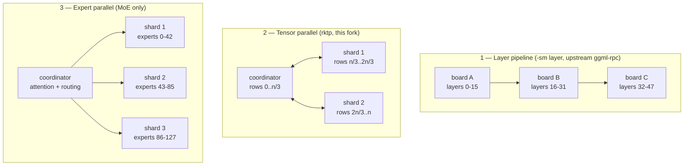

# Distributing a model across multiple RK3588 boards

Three schemes were implemented and measured on a four-node ROCK 5B+ cluster over
**2.5 GbE**. The summary is that multi-board inference on this fabric is a
**capacity** mechanism, not a speed one: it lets a model run that otherwise
could not, and it helps prefill, but single-stream decode does not improve and
usually regresses.

All boards: RK3588, 16 GB, `performance` governors, `taskset -c 4-7`.

---

## The three schemes



| | how it splits | boards active per token | what it is good for |
|---|---|---|---|
| **1. layer pipeline** | whole layers per board | **one at a time** | fitting a model; simplest |
| **2. tensor parallel** | each matmul's output rows | **all simultaneously** | prefill; parallel compute |
| **3. expert parallel** | MoE experts by id | coordinator + owner | fitting a very large MoE |

Scheme 1 is upstream's `-sm layer` over `ggml-rpc`. Schemes 2 and 3 are
implemented in this fork (`ggml/src/ggml-rknpu2/rktp.h`, `tp_shard.cpp`).

## Results

### Dense model that does not fit one board — Qwen3.6-27B

| scheme | boards | TG |
|---|---|---|
| tensor parallel (rktp) | 3 | **1.05** |
| tensor parallel (rktp), Q4_0 | 2 | 0.59 |
| layer pipeline (`-sm layer`) | 3 | 0.53 |
| single board, Q4_0 15.8 GB (streams from NVMe) | 1 | ~0.5 |

**Tensor parallel beats the layer pipeline by 2x here**, which is the one clear
multi-board win. The reason is that the pipeline runs one board at a time, so
three boards give one board's throughput minus network overhead, whereas
tensor-parallel has all three computing on every matmul.

### Model that fits one board — gemma-4-12B

| scheme | boards | TG |
|---|---|---|
| single board | 1 | **1.12-1.54** |
| tensor parallel | 2 | 1.12 |
| tensor parallel | 3 | 1.29 |

**Adding boards does not help once the model fits.** Single board matches or
beats both. Distribute only when you must.

### MoE prefill — Qwen3-30B-A3B

| configuration | boards | PP | TG |
|---|---|---|---|
| single board, experts on CPU | 1 | 21.1 | **9.6** |
| **all 48 expert layers on NPU** across 3 boards | 3 | **26.6** | 2.5 |
| same, KV distributed too | 3 | 26.3 | 1.2 |
| expert-parallel (scheme 3) | 3 | — | 2.31 |

**Best prefill, worst decode.** Three boards give +26% prefill and lose 74% of
decode. For an interactive workload the single board wins outright.

## Why decode does not improve — the arithmetic

Per split matmul, tensor parallelism sends the activations and receives the
remote output rows. **Both scale with M, so the compute-to-traffic ratio is
independent of batch size.** For a K=2048, N=4096 projection split in two:

```
offered  : 2 * M * K * (N/2) FLOP / (4 * M * (K + N/2)) bytes = 512 FLOP/byte
machine  : 150 GFLOPS per board / 0.28 GB/s link            = 536 FLOP/byte
```

**512 < 536, so the link is the binding constraint.** Offloading half a matmul
costs about as much wire time as it saves compute time — before any coordination
overhead. Measured on the production 30B: prefill **-15%**, decode **-23%**
versus single board.

This is a property of the *fabric*, not the implementation. 10 GbE would give a
machine balance near 136 FLOP/byte, well under the offered 512, and would flip
the result. Latency amortises with batch size; **bandwidth does not**.

Why it still wins on the dense 27B: at M=1 the traffic per matmul is only ~16 KB,
so that case is latency-bound rather than bandwidth-bound, and latency does
amortise — against an alternative (`-sm layer`) that only ever uses one board.

## Making it work at all — what had to be fixed

Upstream's RPC path did not support this out of the box.

**Seven fixes to make `-sm layer` distribute weights across NPUs:**

1. An uninitialised `rknn_matmul_io_attr` — worked by luck in one process, failed
   on the RPC server thread's stack.
2. Tensors above the ~2 GB IOMMU domain limit had to be excluded (Gemma's
   2.82 GB per-layer embedding).
3. Per-weight metadata was keyed by **tensor pointer**; over RPC the tensor object
   at load differs from the one at compute. Re-keyed by buffer offset.
4. `token_embd` excluded — it is a `get_rows` embedding, not a matmul weight, and
   NPU requantisation corrupts it.
5. `ggml_backend_rpc_device_supports_op` was a stub returning `true`, so **every**
   op was sent to the remote — where a matmul-only backend silently no-ops
   norms and RoPE, producing fluent nonsense. Delegated to the local RKNPU
   device's own `supports_op`.
6. `get_memory` reported 0, so the scheduler gave the device no layers.
7. Device type reported as accelerator rather than GPU, so `-sm layer` skipped it
   for weight placement.

Fixes 6 and 7 are now **opt-in** (`RKNPU_AS_GPU=1`), because reporting real memory
made llama.cpp try to place the KV cache in NPU memory, which has no `SET_ROWS`.

**One transport fix worth more than all of them:** `ggml-rpc`'s `set_tensor` ran a
byte-at-a-time FNV hash over every tensor above 10 MB, plus an extra round trip
and a zero-initialised full-size staging copy. Raw wire was **280 MB/s** while RPC
achieved **38**. This is backend-agnostic and applies to any `ggml-rpc` user.

**Graph-split locality:** because the NPU backend only claims matmuls, MoE
intermediates ([N, n_expert_used, n_tokens], ~134 MB at ubatch 2048) crossed the
wire several times per layer. Letting the backend claim the cheap ops and run them
on-device cut splits **482 → 196** and traffic **13.9 → 3.3 GB per request**.

## Two hard limits found

- **`tp_shard` is a separate binary and is not a CMake target**, so `make` never
  rebuilt it. A stale shard from an abandoned branch silently answered with
  `ob=0`; the coordinator trusted that length and read past the end of an empty
  vector. This looked for three sessions like an "M>1 prefill crash" in the
  tensor-parallel code, and was neither. The geometry and reply length are now
  validated with a diagnostic that names this cause, and `rebuild_tp_shard.sh`
  exists so it cannot rot again. **After any protocol change, rebuild the shard
  and rsync its ggml libraries too** — a fresh binary against stale
  `libggml-base.so` crashes inside `graph_compute`.
- **Environment must match on both sides.** A coordinator on `W8A8_STANDARD` with
  a shard defaulting `Q4_0` to `W4A4_HADAMARD` aborts on a missing Hadamard
  vector. Any pipeline-selecting variable has to be set identically everywhere.

## Practical guidance

1. **If the model fits one board, use one board.** Measured, repeatedly.
2. **If it does not fit and it is dense**, tensor parallel beats the layer
   pipeline about 2x.
3. **If it does not fit and it is MoE**, prefer `--cpu-moe --no-repack` with mmap
   on a single board — a 60 GB model runs that way at 0.88 t/s. Distribution buys
   prefill and costs decode.
4. **Expect no single-stream decode gain on 2.5 GbE** at these model sizes. The
   arithmetic above says so before you measure it.
5. **Set the governors.** `performance` on CPU, DRAM and NPU is worth **+32%** and
   costs nothing.

## Reproducing

```bash
# on each shard board
./build/bin/tp_shard --role shard --port 48200

# coordinator
RKNPU_TP_SHARD=<shardA>:48200,<shardB>:48200 \
RKNPU_TP_MINN=2048 RKNPU_TP_LOCFRAC=0.34 \
RKNPU_TP_OFFLOAD=0.5 RKNPU_TP_FULLNPU=1 \
RKNPU_HYBRID=W8A8_STANDARD \
taskset -c 4-7 ./build/bin/llama-server -m model.gguf -ngl 99 -t 4 -fa on
```

`RKNPU_TP_LOCFRAC` must divide the output rows on the backend's alignment
boundary. **0.5 for two boards, 0.34 for three.** A value such as 0.6 produces
plausible speeds and silently wrong output — it was measured at "1.06 t/s" before
anyone read the text.
